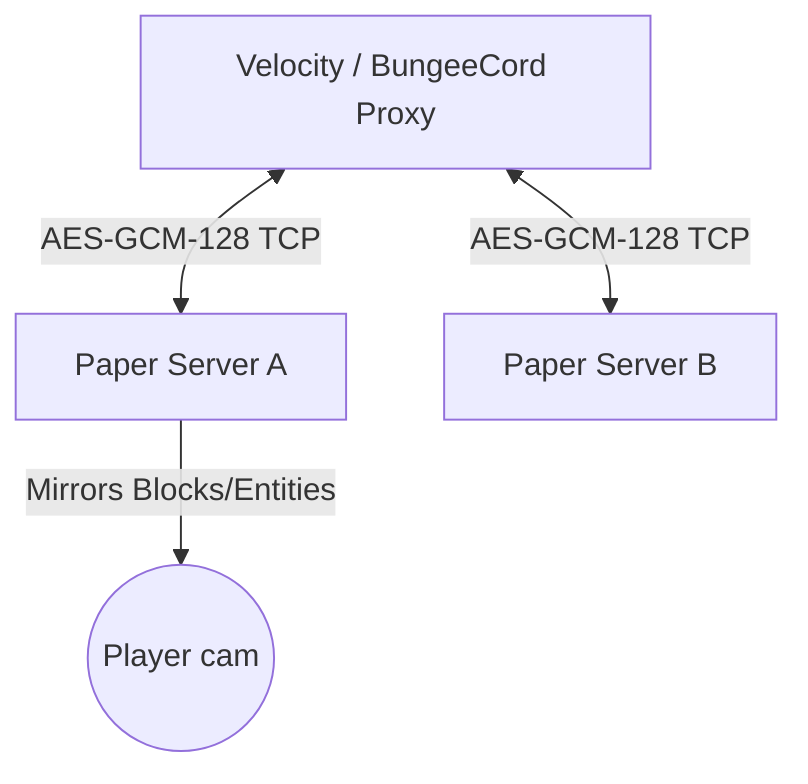

  

<h1 align="center">BetterPortals</h1>

  <strong>An enterprise-grade, highly-optimized, server-side portal rendering and teleportation engine for PaperMC.</strong>

  
  
  
  
  

---

BetterPortals allows players to **see through Nether and custom portals** to view blocks and entities on the target destination in real-time. By utilizing advanced packet manipulation and matrix rotation transformations entirely server-side, it delivers a seamless mod-like experience with **no client-side modifications** required.

> [!IMPORTANT]
> BetterPortals has been modernized. The minimum runtime supported environment is **PaperMC 1.21+** and **Java 21**. Java 25 is required for development/compilation. Traditional Spigot/CraftBukkit and legacy Minecraft versions are deprecated to prioritize modern, high-performance API structures.

---

## ⚡ Core High-Performance Features

* **👁️ Real-time Portal Projection:** Visualizes block changes, chunks, and states across portals dynamically using ProtocolLib.
* **👾 Real-time Entity Mirroring:** Spawns, updates, and translates destination entities (including relative camera yaw/pitch rotations).
* **🌀 Cross-Server Teleportation:** Syncs players across a multi-server proxy network (Velocity / BungeeCord) with zero noticeable transition delay.
* **🏎️ Async Teleportation Engine:** Replaces blocking teleport calls with Paper's non-blocking `teleportAsync` to prevent tick spikes.
* **🛡️ Secure Communication:** Utilizes AES-GCM-128 encryption with private key authentication for cross-server backend communication.
* **📐 Advanced Rotation Matrices:** Dynamically rotates block patterns and player velocities when passing through custom horizontal or vertical portals.

---

## 🏗️ System & Network Architecture

BetterPortals uses a distributed architecture to coordinate cross-server portals. A centralized proxy module (`BetterPortals-proxy`) acts as a secure request router between participating backend Paper servers.

---

## 📚 Technical Documentation Index

Detailed setup guides, configurations, command lists, and developer notes are structured into modular guides under the `docs` directory:

| Document | Description |
| :--- | :--- |
| 🛠️ **[Setup & Installation Guide](docs/setup_guide.md)** | Step-by-step setup for Single Servers, Bungee/Velocity networks, security key generation, and troubleshooting. |
| ⚙️ **[Configuration Guide](docs/configuration_guide.md)** | Explanation of all `config.yml` keys, performance optimization thresholds (TPS Guard), limits, and preset configurations. |
| 🎮 **[Commands & Permissions Guide](docs/commands_permissions.md)** | Comprehensive list of commands, permissions, and a full walkthrough of the interactive Admin GUI. |
| 🌐 **[Localization Guide](docs/localization_guide.md)** | Details on locale-aware systems, client language detection, custom translations, and supported languages. |
| 🏗️ **[Project Modular Architecture](docs/project_structure.md)** | Codebase file structure, module breakdown (`shared`, `api`, `proxy`, `bukkit`, etc.), and dependency trees. |
| 🔌 **[Custom Network Protocol](docs/networking_protocol.md)** | Technical layout of GZIP/AES-GCM encrypted byte packets, handshakes, request-response lifecycles, and request specifications. |
| 💻 **[Developer Reference Guide](docs/developer_guide.md)** | Gradle compile commands, JUnit 5 test instructions, remote debugging configurations, and guide for adding NMS packet features. |

---

## 🚀 Quick Start Compilation

Ensure you have **Java 25** configured on your `PATH` and `JAVA_HOME`.

### 1. Build and Package Options
Compile the plugin or package it with ProtocolLib using the Gradle wrapper:

* **Build standalone plugin JAR only:**
  * Windows: `.\gradlew.bat buildPlugin`
  * Linux / macOS: `./gradlew buildPlugin`
  * **Output:** `./build/libs/BetterPortals-*.jar`

* **Build release ZIP (includes ProtocolLib):**
  * Windows: `.\gradlew.bat buildRelease`
  * Linux / macOS: `./gradlew buildRelease`
  * **Output:** `./build/distributions/BetterPortals-with-ProtocolLib-*.zip`

---

## 🛠️ Developer Test Stack & VS Code Tools
This repository includes a fully automated local testing environment and out-of-the-box configurations for Visual Studio Code (`.vscode/` folder):

### 1. Requirements
- **Java JDK 25** (installed and set as default in your system `PATH`/`JAVA_HOME`).
- **Gradle 9.4.1** (automatically managed by the repository's Gradle Wrapper).

### 2. Launching the Stack (F5)
Press **F5** in VS Code to run the **`🚀 BetterPortals: Full Stack (F5)`** configuration. This automatically:
1. Shuts down any stale Java test instances (`Kill Java` task).
2. Cleans temporary dynamic test files like worlds, logs, and cache (`cleanTest` task).
3. Compiles the latest shaded JAR containing all modules (`buildAll` task).
4. Runs a **Paper Server** (on port `25565`) with the fresh plugin.
5. Launches a **Fabric Client** that connects directly to the server for instant verification.

### 3. Task Automation
You can also run these tasks manually via the VS Code Command Palette (`Ctrl+Shift+P` -> `Run Task`):
- `🚀 Run Full Stack (Server + Client)`: Launches the complete test environment (Paper + Client).
- `🚀 Run Folia Stack (Folia + Client)`: Launches the Folia server alongside the client using optimized, minimized resources:
  - Server limited to **1GB heap** (`-Xmx1G`).
  - Client limited to **1.2GB heap** (`-Xmx1200M`).
  - Folia region thread pool limited to **1 thread** and async pool to **2 threads** to prevent local CPU overload.
- `Cleanup Test Data`: Cleans dynamic server and client runtime files.
- `Build All Plugins`: Compiles the shadowed plugin jar.
- `Gradle Test`: Executes the JUnit 5 test suite.

---

## 🛡️ License
BetterPortals is distributed under the **MIT License**. See `LICENSE` for details.
