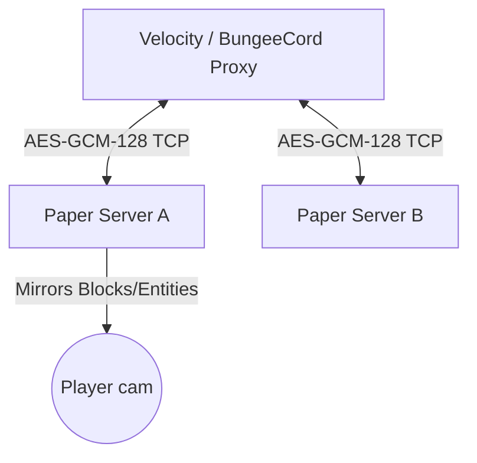

<p align="center">
  
</p>

<h1 align="center">BetterPortals</h1>

<p align="center">
  <strong>An enterprise-grade, highly-optimized, server-side portal rendering and teleportation engine for PaperMC.</strong>
</p>

<p align="center">
  <a href="https://github.com/Lauriethefish/BetterPortals/actions"></a>
  <a href="https://papermc.io"></a>
  <a href="https://adoptium.net/"></a>
  <a href="https://github.com/Lauriethefish/BetterPortals/blob/main/LICENSE"></a>
  <a href="https://velocitypowered.com"></a>
</p>

---

BetterPortals allows players to **see through Nether and custom portals** to view blocks and entities on the target destination in real-time. By utilizing advanced packet manipulation and matrix rotation transformations entirely server-side, it delivers a seamless mod-like experience with **no client-side modifications** required.

> [!IMPORTANT]
> BetterPortals has been modernized. The minimum supported environment is **PaperMC 1.21 / 26.1.2** and **Java 17/21**. Traditional Spigot/CraftBukkit and legacy Minecraft versions are deprecated to prioritize modern, high-performance API structures.

---

## ⚡ Core High-Performance Features

* **👁️ Real-time Portal Projection:** Visualizes block changes, chunks, and states across portals dynamically using ProtocolLib.
* **👾 Real-time Entity Mirroring:** Spawns, updates, and translates destination entities (including relative camera yaw/pitch rotations).
* **🌀 Cross-Server Teleportation:** Syncs players across a multi-server proxy network (Velocity / BungeeCord) with zero noticeable transition delay.
* **🏎️ Async Teleportation Engine:** Replaces blocking teleport calls with Paper's non-blocking `teleportAsync` to prevent tick spikes.
* **🛡️ Secure Communication:** Utilizes AES-GCM-128 encryption with private key authentication for cross-server backend communication.
* **📐 Advanced Rotation Matrices:** Dynamically rotates block patterns and player velocities when passing through custom horizontal or vertical portals.

---

## 🏗️ System & Network Architecture

BetterPortals uses a distributed architecture to coordinate cross-server portals. A centralized proxy module (`BetterPortals-proxy`) acts as a secure request router between participating backend Paper servers.



---

## 📚 Technical Documentation Index

Detailed setup guides, protocols, and developer notes are separated into dedicated modules under the `docs` directory:

| Document | Description |
| :--- | :--- |
| 🛠️ **[Setup & Installation Guide](docs/setup_guide.md)** | Step-by-step setup for Single Servers, Bungee/Velocity networks, security key generation, commands, and troubleshooting. |
| 🏗️ **[Project Modular Architecture](docs/project_structure.md)** | Codebase file structure, module breakdown (`shared`, `api`, `proxy`, `bukkit`, etc.), and dependency trees. |
| 🔌 **[Custom Network Protocol](docs/networking_protocol.md)** | Technical layout of GZIP/AES-GCM encrypted byte packets, handshakes, request-response lifecycles, and request specifications. |
| 💻 **[Developer Reference Guide](docs/developer_guide.md)** | Gradle compile commands, JUnit 5 test instructions, remote debugging configurations, and guide for adding NMS packet features. |

---

## 🚀 Quick Start Compilation

Ensure you have **Java 17** or **Java 21** configured on your `PATH` and `JAVA_HOME`.

### 1. Build and Shade
Compile and build the shaded multi-platform artifact using the Gradle wrapper:

* **Windows:**
  ```powershell
  .\gradlew.bat clean shadowJar
  ```
* **Linux / macOS:**
  ```bash
  chmod +x gradlew
  ./gradlew clean shadowJar
  ```

### 2. Output Artifact
The compiled, optimized, and minimized shaded JAR (compatible with Paper, Velocity, and BungeeCord) will be generated at:
`./final/build/libs/BetterPortals-final-all.jar`

---

## 🛠️ VS Code Developer Tools
This repository includes out-of-the-box configurations for Visual Studio Code (`.vscode/` folder):
* **F5 Launching:** Direct attachment config for remote debugging on port `5005` (Paper) and `5006` (Velocity).
* **Task Automation:** Tasks to build, package (`shadowJar`), or run the test suite (`test`) directly from the IDE command palette.

---

## 🛡️ License
BetterPortals is distributed under the **MIT License**. See `LICENSE` for details.
