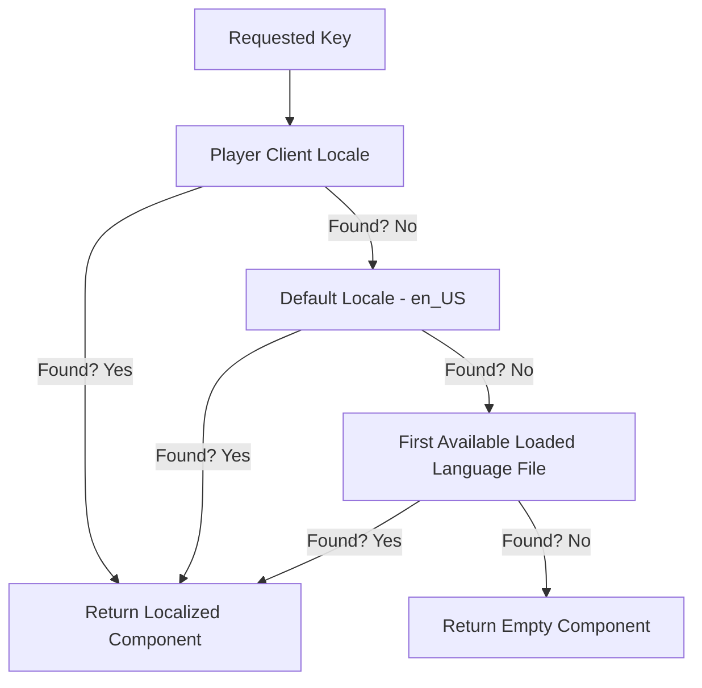

# BetterPortals Localization Guide

BetterPortals features a highly customizable, per-player localization system. It automatically translates messages, command help menus, and administrative GUIs dynamically based on the language of the connecting player.

---

## 🌐 Dynamic Client-Language Detection

Rather than forcing the entire server to use a single language, BetterPortals adapts to each player:
1. **Detection:** When a player joins or changes their language settings in Minecraft, the server captures a `PlayerLocaleChangeEvent`.
2. **Matching:** The system normalizes the BCP-47 tag (e.g. `en-GB` or `ru-ru`) to `lang_REGION` (e.g. `en_US` or `ru_RU`).
   - First, it checks for an exact match among the loaded language files.
   - If not found, it tries to match the language prefix (e.g. `en` matches `en_US` if `en_GB` is not present).
3. **Session Cache:** The resolved language tag is cached in a memory-safe `ConcurrentHashMap` using the player's `UUID` as the key. This prevents memory leaks by avoiding strong references to `Player` objects, and the cache is automatically cleared when the player leaves.

---

## ⛓️ Translation Fallback Chain

If a translation key or configuration is missing in a player's primary language file, the plugin automatically resolves the key through a secure fallback chain to ensure players never receive blank messages or syntax errors:

1. **Player Client Locale:** (e.g., `es_ES.yml`)
2. **Default Configured Locale:** (e.g., `en_US.yml` in `MainModule.java`)
3. **Registry Fallback:** Loops through other loaded translation files in alphabetical order.
4. **Empty Return:** If the key is completely missing across all files, it returns an empty text component to prevent errors.

---

## 📜 Editing & Customizing Translations

Translation files are located in `plugins/BetterPortals/lang/`. You can edit existing translation files or create custom ones (e.g., `fr_CA.yml`).

### MiniMessage Styling
BetterPortals uses the **Kyori Adventure** library with **MiniMessage** formatting. This allows you to style messages with advanced text elements:

* **Simple Colors:** `<red>Warning!</red>` or `<green>Success</green>`
* **RGB Hex Colors:** `<color:#ff5577>Custom Color</color>`
* **Gradients:** `<gradient:red:blue>Beautiful Gradient Text</gradient>`
* **Click Actions:** `<click:run_command:"/bp menu">Click here to open GUI</click>`
* **Hover Text:** `<hover:show_text:"Hover description!">Hover me</hover>`

### Dynamic Placeholders
Many messages support dynamic variables. These variables are replaced before compiling:
* `{id}`: The UUID or ID of the portal.
* `{name}`: The custom name of the portal.
* `{price}`: The entrance price fee formatted as currency (e.g. `$5.00`).
* `{preset}`: The active effects preset.
* `{page}` / `{total_pages}`: Page indicators for paginated menus.

---

## 🌎 Supported Languages

BetterPortals comes pre-bundled with **27 languages** inside the jar file, extracted automatically into the `lang/` folder on startup:

| Code | Language | Code | Language |
| :--- | :--- | :--- | :--- |
| `ar_SA` | Arabic (Saudi Arabia) | `nl_NL` | Dutch (Netherlands) |
| `cs_CZ` | Czech (Czech Republic) | `pl_PL` | Polish (Poland) |
| `da_DK` | Danish (Denmark) | `pt_BR` | Portuguese (Brazil) |
| `de_DE` | German (Germany) | `ro_RO` | Romanian (Romania) |
| `en_US` | English (United States) | `ru_RU` | Russian (Russia) |
| `es_ES` | Spanish (Spain) | `sk_SK` | Slovak (Slovakia) |
| `fr_FR` | French (France) | `sv_SE` | Swedish (Sweden) |
| `he_IL` | Hebrew (Israel) | `th_TH` | Thai (Thailand) |
| `hu_HU` | Hungarian (Hungary) | `tr_TR` | Turkish (Turkey) |
| `id_ID` | Indonesian (Indonesia) | `uk_UA` | Ukrainian (Ukraine) |
| `it_IT` | Italian (Italy) | `vi_VN` | Vietnamese (Vietnam) |
| `ja_JP` | Japanese (Japan) | `zh_CN` | Chinese (Simplified) |
| `ko_KR` | Korean (South Korea) | `zh_TW` | Chinese (Traditional) |
| `lt_LT` | Lithuanian (Lithuania) | | |

*Note: You can add new languages or modify these. The system automatically scans the folder for any file ending with `.yml`.*
