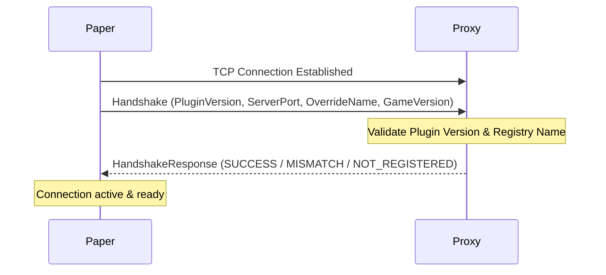

# Networking Protocol

BetterPortals uses a custom, encrypted TCP socket-based protocol to synchronize player actions, teleportations, and portal states across multiple Paper servers and the proxy.

---

## 🔌 Connection & Handshake Flow

When a Paper server boots up, it initiates a persistent TCP socket connection to the proxy server port (default `25585`).



### Handshake Validation
1. **Plugin Version Check:** The proxy compares the plugin version in `Handshake`. If they do not match, it returns `PLUGIN_VERSION_MISMATCH` and disconnects (to avoid network protocol conflicts).
2. **Server Identification:** The proxy determines the name of the connecting server. It first checks for `overrideServerName`. If none is specified, it matches the socket IP and stated server port against the proxy's server registry. If no match is found, it returns `SERVER_NOT_REGISTERED`.

---

## 🔒 Cryptographic Wrapper & Packet Structure

All packets sent over the socket are wrapped in an encryption layer using **AES-GCM-128** with a shared key, compressed using **GZIP**.

### Byte Packet Layout
When a packet is written by `EncryptedObjectStream`:
1. **Length Header (4 bytes):** Big-endian integer specifying the length of the GZIP compressed and encrypted object.
2. **Payload Block (variable length):** The AES-GCM encrypted bytes representing the serialized Java object.
3. **IV/Nonce Block (12 bytes):** The random Initialization Vector generated by the cipher for GCM mode.

```
+--------------------+---------------------------------------+-------------------------+
| Length (4 bytes)   | Encrypted Object Payload (N bytes)   | GCM Nonce (12 bytes)    |
+--------------------+---------------------------------------+-------------------------+
```

---

## 📦 Request-Response Lifecycle

Both Paper clients and the Proxy track asynchronous packets using a **Request ID** system:
1. The sender increments an `AtomicInteger` to assign a unique ID to a `Request` object.
2. The sender places the ID and a callback function (`Consumer<Response>`) into a thread-safe `waitingRequests` map.
3. The sender writes the request over the socket.
4. The receiver processes the request and returns a `Response` containing the same ID.
5. The sender receives the response, retrieves the callback from `waitingRequests` using the ID, removes it, and executes the callback on the main server thread.

---

## 📝 Request Definitions

### 1. `TeleportRequest`
* **Flow:** Paper A ➡️ Proxy ➡️ Paper B ➡️ Proxy ➡️ Paper A.
* **Purpose:** Triggers a cross-server teleportation. 
* **Payload:** Target coordinates, velocities, pitch, yaw, destination server, and world names.
* **Mechanism:**
  - Paper A calculates the destination coordinates and sends `TeleportRequest` to the proxy.
  - The proxy forwards the request to Paper B (target).
  - Paper B registers the player's teleport-on-join data and returns success.
  - The proxy receives Paper B's acknowledgement, updates the player's server via the proxy API, and returns success to Paper A.

### 2. `RelayRequest`
* **Flow:** Paper A ➡️ Proxy ➡️ Paper B.
* **Purpose:** Passes a packet to another backend server.
* **Payload:** Destination server name and serialized payload.
* **Mechanism:** The proxy receives the relay request, looks up the destination server's `ClientHandler`, and writes the packet directly to its socket.

### 3. `PreviousServerPutRequest`
* **Flow:** Proxy ➡️ Paper (target).
* **Purpose:** Tracks where a player switched from.
* **Payload:** Player UUID and the name of the previous server.
* **Mechanism:** Fired by the proxy switch listeners (`ServerSwitchEvent` / `ServerConnectedEvent`) to let the destination server copy portal selections or clean up entity trackers.

---

## ⚠️ Networking Threading Model
* **Spawning:** Each connection has a dedicated worker thread (`new Thread()`) running a loop:
  `Object next = objectStream.readObject();`
* **Safety:** When sending requests or responses, the serialization is synchronized:
  ```java
  private synchronized void send(Object obj) { ... }
  ```
* **Disconnections:** If an `IOException` occurs or a `DisconnectNotice` is received, the socket is closed, and any outstanding requests in `waitingRequests` are failed with a `RequestException`.
