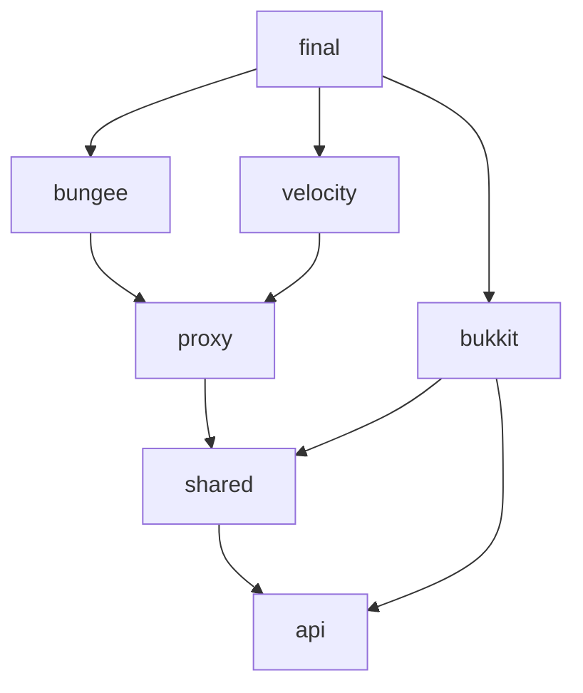

# Project Structure

BetterPortals uses a Gradle multi-module layout to share networking and math routines across different Minecraft platforms (Paper, BungeeCord, and Velocity).

---

## 🏗️ Module Architecture Diagram

The diagram below shows how the modules depend on one another. The `final` module packages everything into a single shaded jar containing all platform implementations.

---

## 📂 Module Descriptions

### 1. `api`
* **Path:** `[api](file:///c:/Users/Nikita/Documents/GitHub/BetterPortals/api/)`
* **Purpose:** Exposes public interfaces for portal registration and integration.
* **Key Components:**
  - Interfaces for accessing portals programmatically from third-party plugins.

### 2. `shared`
* **Path:** `[shared](file:///c:/Users/Nikita/Documents/GitHub/BetterPortals/shared/)`
* **Purpose:** Contains all utility classes, logging wrappers, and core networking objects shared between Spigot/Paper servers and proxies.
* **Key Components:**
  - `com.lauriethefish.betterportals.shared.net`: Networking requests (e.g. `TeleportRequest`, `RelayRequest`) and responses.
  - `com.lauriethefish.betterportals.shared.net.encryption`: Low-level AES-GCM-128 cryptographic streams (`EncryptedObjectStream`).
  - `com.lauriethefish.betterportals.shared.logging`: Platform-agnostic logger interfaces.

### 3. `proxy`
* **Path:** `[proxy](file:///c:/Users/Nikita/Documents/GitHub/BetterPortals/proxy/)`
* **Purpose:** Handles the common networking server logic running on the proxy.
* **Key Components:**
  - `PortalServer`: The socket server listener running on its own thread.
  - `ClientHandler`: Receives/sends packets for a specific connected backend server.
  - `ProxyRequestHandler`: Translates incoming requests, shifts player servers on the proxy, and coordinates cross-server requests.

### 4. `bukkit`
* **Path:** `[bukkit](file:///c:/Users/Nikita/Documents/GitHub/BetterPortals/bukkit/)`
* **Purpose:** The main Paper/Spigot implementation. This is the largest module containing all portal mathematics, block-view synchronization, and NMS/ProtocolLib packet handling.
* **Key Components:**
  - `nms`: Dynamic block detection (`MaterialUtil`), ProtocolLib wrappers, and packet factories (`PacketUtil`).
  - `player`: Tracking player positions, camera rotations, and portal view calculations.
  - `entity`: Spawning and updating mirrored entity packets across portals (`PortalEntityManager`).
  - `tasks`: Asynchronous tasks for updating block states and refreshing visual windows.

### 5. `bungee`
* **Path:** `[bungee](file:///c:/Users/Nikita/Documents/GitHub/BetterPortals/bungee/)`
* **Purpose:** The BungeeCord entry point module. It sets up Guice injection and registers server-switching listeners.

### 6. `velocity`
* **Path:** `[velocity](file:///c:/Users/Nikita/Documents/GitHub/BetterPortals/velocity/)`
* **Purpose:** The Velocity entry point module. It handles registration, configuration file parsing, and server-switch listening using the modern Velocity event bus.

### 7. `final`
* **Path:** `[final](file:///c:/Users/Nikita/Documents/GitHub/BetterPortals/final/)`
* **Purpose:** Consolidates all other modules into a single, multi-platform shaded JAR using the Gradle Shadow plugin.
