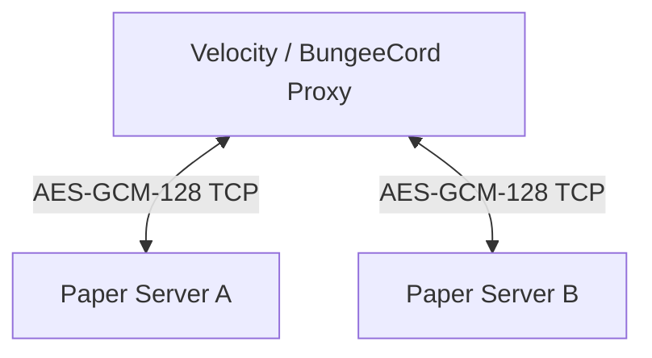

# BetterPortals Setup Guide

This guide describes how to install, configure, and manage BetterPortals on your Minecraft server network.

---

## 📋 Requirements
Before installing, ensure your environment meets the following specifications:
* **Server Version:** PaperMC 1.21 / 26.1.2 or higher (pure Bukkit or Spigot is not supported due to modern Paper API usage).
* **Proxy (Optional for cross-server portals):** Velocity 3.3.0+ or BungeeCord/WaterFall.
* **Java Version:** Java 17 or Java 21 (both runtime and compile-time).
* **ProtocolLib:** The latest release compatible with your server version.

---

## 🚀 Installation & Configuration

### Option A: Single-Server Setup
If you only run a single Minecraft server and do not need cross-server portals:
1. Copy the compiled `BetterPortals-final-all.jar` (shaded JAR) into your server's `plugins/` directory.
2. Ensure you have the compatible version of **ProtocolLib** in the same folder.
3. Start the server to generate default configurations in `plugins/BetterPortals/`.
4. Open `plugins/BetterPortals/config.yml` to customize settings like portal search radii or viewing distances.
5. Restart the server or run `/bp reload`.

---

### Option B: Proxy-Network Setup (Cross-Server Portals)
To link portals between multiple backend servers, you need to run the plugin on both the proxy and all participating backend servers.

#### Step 1: Proxy Setup
1. Copy `BetterPortals-final-all.jar` to the `plugins/` folder of your proxy server (Velocity or BungeeCord).
2. Start the proxy server to generate configuration files.
3. Open the generated configuration (`plugins/BetterPortals/config.yml` on Bungee or `plugins/betterportals/config.yml` on Velocity) and configure:
   - `bindAddress`: The IP address of the proxy.
   - `serverPort`: A port dedicated to the BetterPortals communication channel (default is usually `25585`).
   - `key`: A unique AES encryption key. This is a UUID that must be identical across all backend servers and the proxy.
4. Restart your proxy.

#### Step 2: Backend (Paper) Server Setup
1. Copy `BetterPortals-final-all.jar` to the `plugins/` folder of every Paper server.
2. Start the servers to generate default config files.
3. Open `plugins/BetterPortals/config.yml` on each backend server, locate the `proxy` section, and configure:
   - `enabled`: `true`
   - `address`: The IP address of your proxy server.
   - `port`: The port specified on your proxy configuration (e.g. `25585`).
   - `encryptionKey`: The identical UUID string configured on the proxy.
4. Restart all backend servers.

---

## 🔑 Security & Encryption Configuration
Communication between backend Spigot/Paper servers and the proxy is encrypted with AES-GCM (128-bit) using a shared key.
> [!CAUTION]
> Never share your encryption key (`key` or `encryptionKey` in config) with unauthorized users. If an attacker gains access to this key, they can spoof packet requests and perform actions or bypass authentication checks.

If you need to generate a new encryption key, you can generate a random UUID and paste it into the configuration files:
* **Example Key:** `9b1deb4d-3b7d-4bad-9bdd-2b0d7b3d4b6d`

---

## 🎮 Commands & Permissions

| Command | Permission | Description |
| :--- | :--- | :--- |
| `/bp reload` | `betterportals.reload` | Reloads the configuration file. |
| `/bp create <portalName> [destServer] [destWorld]` | `betterportals.create` | Creates a new custom portal. |
| `/bp delete <portalName>` | `betterportals.delete` | Deletes a custom portal. |
| `/bp list` | `betterportals.list` | Lists all active portals. |
| `/bp origin <portalName>` | `betterportals.origin` | Sets the origin position of a custom portal. |
| `/bp destination <portalName>` | `betterportals.destination` | Sets the destination position of a custom portal. |

---

## 🔍 Troubleshooting

### 1. Connection Refused / Timed Out
* **Symptom:** Backend servers show errors like `IO error occurred while connected to the proxy` or fail to connect.
* **Resolution:** Ensure the proxy port (e.g., `25585`) is open in your server firewall and that the bind address matches the proxy server's IP address.

### 2. Encryption Key Mismatch
* **Symptom:** Proxy logs show `Failed to initialise encryption with ... Please make sure that your encryption key is valid!`.
* **Resolution:** Double-check that the `key` UUID on the Velocity/Bungee config exactly matches the `encryptionKey` UUID on the Spigot/Paper configs.

### 3. Server Unregistered / Handshake Failure
* **Symptom:** Backend servers show `Handshake failed: SERVER_NOT_REGISTERED`.
* **Resolution:** Ensure that the server names in the proxy's `config.yml` (e.g. `lobby`, `survival` in Velocity's `velocity.toml` or Bungee's `config.yml`) match what the backend servers are declaring. If necessary, use `overrideServerName` in the backend config to force a name match.
