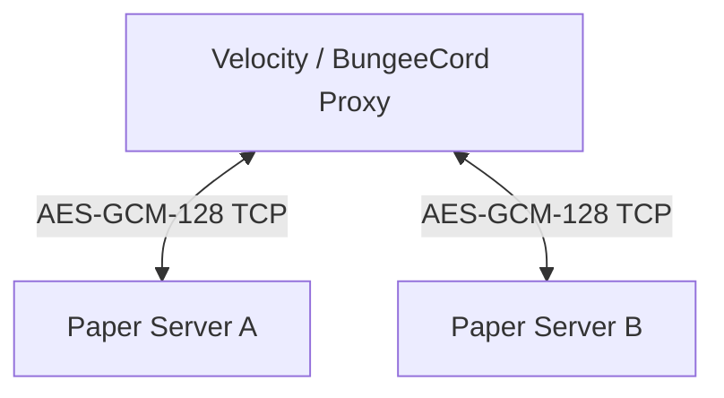

# BetterPortals Setup Guide

This guide describes how to install, configure, and manage BetterPortals on your Minecraft server network.

---

## 📋 Requirements

Before installing, ensure your environment meets the following specifications:
* **Server Version:** PaperMC 1.21+ (Spigot/Bukkit is not supported due to modern Paper API usage).
* **Java Version:** Java 21+ (Runtime compatibility), Java 25 (Required for compiling).
* **ProtocolLib:** The latest release compatible with your Minecraft server version.
* **Vault (Optional):** Required only if you want to use the portal economy integration.
* **Proxy (Optional for cross-server portals):** Velocity 3.3.0+ or BungeeCord/Waterfall.

---

## 🌟 Key Features

### 1. Per-Player Localization
* The plugin automatically detects each player's Minecraft client language setting (`PlayerLocaleChangeEvent`).
* Messages, commands, help menus, and GUIs are automatically rendered in the player's language.
* Supports **27 pre-bundled languages** and customizable locales. Learn more in the [Localization Guide](localization_guide.md).

### 2. Interactive Portal Admin GUI
* Fully interactive in-game GUI menu accessible via `/bp gui` or `/bp menu`.
* Allows administrators to manage all custom portals, toggle mob/item teleportation, adjust entry prices, select effect presets, toggle sounds, and delete portals with click actions. Learn more in the [Commands & Permissions Guide](commands_permissions.md).

### 3. Visual Selection Particles
* While using the portal selection wand (`/bp wand`), a 3D grid outlining selections is drawn using particles.
* *Active selection:* Happy villager particles (green).
* *Origin selection:* Heart particles.
* *Destination selection:* Portal magic particles.
* *Optimization:* Particles are rendered client-side only for the active player. Grids automatically fade out after 60 seconds of inactivity to save client FPS.

### 4. Vault Economy Integration
* Charge players in-game currency to pass through custom portals.
* Configure portal prices dynamically using the Admin GUI or `/bp setprice <price>`.
* Stepping through charges the player automatically via Vault; teleportation is canceled with a notification if funds are insufficient.

### 5. Adaptive Performance & TPS Guard
* The plugin monitors server performance in real-time.
* If server TPS drops below the configured threshold (e.g. `19.0` TPS), portal rendering is paused to save server ticks.
* Portal views resume automatically as soon as the server stabilizes. Learn more in the [Configuration Guide](configuration_guide.md).

### 6. Custom Portal Particle & Sound Presets
* Configure ambient themes (particles and sounds) for custom portals in `config.yml`.
* Apply presets on the closest portal using `/bp setpreset <presetName>` or the GUI.

---

## 📖 Detailed Guides

To configure or manage specific aspects of BetterPortals, refer to these dedicated guides:
* ⚙️ **[Configuration Guide](configuration_guide.md):** Detailed breakdown of all `config.yml` keys, performance tuning, and portal presets.
* 🎮 **[Commands & Permissions Guide](commands_permissions.md):** Complete command reference and a walkthrough of the Interactive Admin GUI.
* 🌐 **[Localization Guide](localization_guide.md):** Client language detection, custom translations, and supported languages.
* 🛠️ **[Developer Guide](developer_guide.md):** Multi-module structure, compilation tasks, testing, and debugging.
* 🏗️ **[Project Structure](project_structure.md):** Guide to the multi-module layout.
* 🔌 **[Networking Protocol](networking_protocol.md):** Technical walkthrough of the custom TCP socket communication protocol.

---

## 🚀 Installation

### Option A: Single-Server Setup
If you only run a single Minecraft server and do not need cross-server portals:
1. Copy the compiled `BetterPortals-final-all.jar` into your server's `plugins/` directory.
2. Ensure **ProtocolLib** and **Vault** are in the same folder.
3. Start the server to generate default configurations in `plugins/BetterPortals/`.
4. Open `plugins/BetterPortals/config.yml` to customize settings.
5. Reload config using `/bp reload`.

---

### Option B: Proxy-Network Setup (Cross-Server Portals)
To link portals between multiple backend servers, you need to run the plugin on both the proxy and all participating backend servers.

#### Step 1: Proxy Setup
1. Copy `BetterPortals-final-all.jar` to the `plugins/` folder of your proxy server (Velocity or BungeeCord).
2. Start the proxy server to generate configuration files.
3. Open the generated configuration (`plugins/BetterPortals/config.yml` on Bungee or `plugins/betterportals/config.yml` on Velocity) and configure:
   - `bindAddress`: The IP address of the proxy.
   - `serverPort`: A port dedicated to the BetterPortals communication channel (default: `25585`).
   - `key`: A unique AES encryption key. This is a UUID that must be identical across all backend servers and the proxy.
4. Restart your proxy.

#### Step 2: Backend (Paper) Server Setup
1. Copy `BetterPortals-final-all.jar` to the `plugins/` folder of every Paper server.
2. Start the servers to generate default config files.
3. Open `plugins/BetterPortals/config.yml` on each backend server, locate the `proxy` section, and configure:
   - `enabled`: `true`
   - `address`: The IP address of your proxy server.
   - `port`: The port specified on your proxy configuration (e.g. `25585`).
   - `encryptionKey`: The identical UUID string configured on the proxy.
4. Restart all backend servers.

---

## 🔑 Security & Encryption Configuration
Communication between backend Paper servers and the proxy is encrypted with AES-GCM (128-bit) using a shared key.
> [!CAUTION]
> Never share your encryption key (`key` or `encryptionKey` in config) with unauthorized users. If an attacker gains access to this key, they can spoof packet requests and bypass authentication checks.

If you need to generate a new encryption key, you can generate a random UUID and paste it into the configuration files:
* **Example Key:** `9b1deb4d-3b7d-4bad-9bdd-2b0d7b3d4b6d`

---

## 🔍 Troubleshooting

### 1. Connection Refused / Timed Out
* **Symptom:** Backend servers show errors like `IO error occurred while connected to the proxy` or fail to connect.
* **Resolution:** Ensure the proxy port (e.g., `25585`) is open in your server firewall and that the bind address matches the proxy server's IP address.

### 2. Encryption Key Mismatch
* **Symptom:** Proxy logs show `Failed to initialise encryption with ...`.
* **Resolution:** Double-check that the `key` UUID on the Velocity/Bungee config exactly matches the `encryptionKey` UUID on the Spigot/Paper configs.

### 3. Server Unregistered / Handshake Failure
* **Symptom:** Backend servers show `Handshake failed: SERVER_NOT_REGISTERED`.
* **Resolution:** Ensure that the server names in the proxy's `config.yml` match what the backend servers are declaring. If necessary, use `overrideServerName` in the backend config to force a name match.
